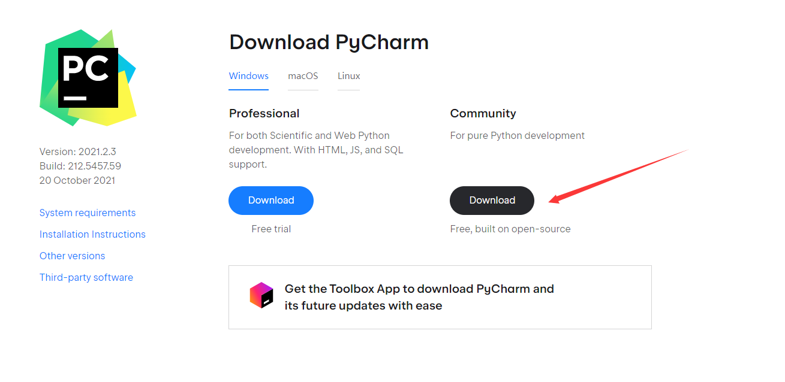

# Python语言：环境搭建

Python语言有着两个版本：

1. Python 2.x
2. Python 3.x

虽然有部分的程序依旧采用了Python 2.x进行编写，但是我们主要采用Python 3.x 进行编程。

在搜索引擎中搜索Python便可以找到Python官网，在Python官网中就可以对Python进行下载：

安装完成之后，可以通过CMD来查看是否安装成功和是否将Python加入到了Path中：

这里推荐使用的IDE是Pycharm编译器：

对于新人而言只需要使用社区版就可以了。

