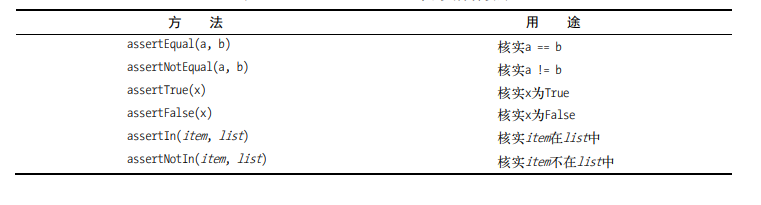

# Python语言：测试代码

# 编写测试

我们先写一个简单的函数：

```python
def get_formatted_name(first, last):
  """generate a neatly formatted full name."""
  full_name = first + " " + last
  return full_name.title()
```


函数get_formatted_name()将名和姓合并成姓名，在名和姓之间加上一个空格，并且将它们的首字母都大写，再返回结果。

为了核实get_formatted_name()像期望的那样工作，我们可以编写一个使用这个函数的程序，[程序名称未names.py](http://xn--names-y08ht14duxp203bwha.py)，用来让用户输入名和姓，并且显示整洁的全名：

```python
from name_function import get_formatted_name
print("Enter 'q' at any time to quit.")

while True:
  
  first = input("\nPlease give me a first name: ")
  if first == 'q':
    break

  last = input("Please give me a last name: ")
  if last == 'q':
    break

  formatted_name = get_formatted_name(first, last)
  print("\tNeatly formatted name: " + formatted_name + ".")
```


测试结果为：

```python
Enter 'q' at any time to quit.

Please give me a first name: janis
Please give me a last name: joplin
  Neatly formatted name: Janis Joplin.

Please give me a first name: bob
Please give me a last name: dylan
  Neatly formatted name: Bob Dylan.

Please give me a first name: q
```


从上述输出可知，合并得到的姓名正确无误。现在假设我们要修改get_formatted_name()，使其还能够处理中间名。这样做时，我们要确保不破坏这个函数处理只有名和姓的姓名的方式。

为此，我们可以在每次修改get_formatted_name()后都进行测试：运行程序names.py，并输入像Janis Joplin这样的姓名，但这太烦琐了。所幸Python提供了一种自动测试函数输出的高效方式。

倘若我们对get_formatted_name()进行自动测试，就能始终信心满满，确信给这个函数提供我们测试过的姓名时，它都能正确地工作。

Python标准库钟的模块unittest提供了代码测试工具。

单元测试用于核实函数的某个方面是否有问题；测试用例是一组单元测试，这些单元测试一起核实函数在各种情形下的行为都要符合要求。

良好的测试用例考虑到了函数可能收到的各种输入，包含针对所有这些情形的测试。全覆盖式测试用例包含一整套单元测试，涵盖了各种可能的函数使用方式。对于大型项目，要实现全覆盖可能很难。通常，最初只要针对代码的重要行为编写测试即可，等项目被广泛使用时再考虑全覆盖。

我们先写一个只包含一个方法的测试用例，它检查函数get_formatted_name()在给定名和姓时候是否能够正确的工作：

```python
import unittest
from name_function import get_formatted_name

class NamesTestCase(unittest.TestCase):
  """测试name_function.py"""

  def test_first_last_name(self):
    """能够正确的处理像janis joplin这样的姓名吗"""
    formatted_name = get_formatted_name("janis", "joplin")
    self.assertEqual(formatted_name, 'Janis Joplin')

unittest.main()
```


我们首先导入了模块unittest和要测试的函数get_formatted_name()。我们创建了一个名为NamesTestCase的类，用于包含一系列针对get_formatted_name()的单元测试，并且这个类需要继承unittest.TestCase类，这样才能够让Python知道如何运行编写的测试。

NamesTestCase只包含了一个方法，用于用于测试get_formatted_name()的一个方面。我们将这个方法命名为test_first_last_name()，因为我们要核实的是只有名和姓的姓名能否被正确地格式化。我们运行test_name_function.py时，所有以test_打头的方法都将自动运行。在这个方法中，我们调用了要测试的函数，并存储了要测试的返回值。在这个示例中，我们使用实参'janis'和'joplin'调用get_formatted_name()，并将结果存储到变量formatted_name中。

我们使用了unittest类最有用的功能之一：一个断言方法。断言方法用来核实得到的结果是否与期望的结果一致。在这里，我们知道get_formatted_name()应返回这样的姓名，即名和姓的首字母为大写，且它们之间有一个空格，因此我们期望formatted_name的值为Janis

Joplin。为检查是否确实如此，我们调用unittest的方法assertEqual()，并向它传递formatted_name和'Janis Joplin'。代码行self.assertEqual(formatted_name, 'Janis Joplin')的意思是说：“将formatted_name的值同字符串'Janis Joplin'进行比较，如果它们相等，就万事大吉，如果它们不相等，跟我说一声！”

运行的结果为：

```python
.
----------------------------------------------------------------------
Ran 1 test in 0.000s

OK
```


第一行的句点 . 表明了有一个测试通过了。

第二行的一行只出了Python运行了一个测试，消耗的时间不到0.001秒。

第三行的ok表明了该测试用例钟的所有单元测试都通过了。

我们可以修改程序让程序的输出不符合预期从而达到测试不通过的结果。

我们首先对函数get_formatted_name()进行修改：

```python
def get_formatted_name(first, middle, last):
  """generate a neatly formatted full name."""
  full_name = first + " " + middle + " " + last
  return full_name.title()
```


在这样的情况之下，名字除了first name和last name，还多出了middle name，并且middle name是必须输入的。

如此一下这个程序就不能够正确的处理只有名和姓的姓名了，运行测试程序的结果如下所示：

```python
E
======================================================================
ERROR: test_first_last_name (__main__.NamesTestCase)
能够正确的处理像janis joplin这样的姓名吗
----------------------------------------------------------------------
Traceback (most recent call last):
  File "test_name_function.py", line 9, in test_first_last_name
    formatted_name = get_formatted_name("janis", "joplin")
TypeError: get_formatted_name() missing 1 required positional argument: 'last'

----------------------------------------------------------------------
Ran 1 test in 0.001s

FAILED (errors=1)
```


这一个结果中包含了大量的信息。

首先是一个字母E，它指出测试用例中有一个单元测试导致了错误

接着是ERROR: test_first_last_name (**main**.NamesTestCase)，这表明了错误是因为test_first_last_name()导致的。测试用例包含众多单元测试时，

知道哪个测试未通过至关重要。

接着我们看到了一个标准的traceback，它指出函数调用

get_formatted_name('janis', 'joplin')有问题，因为它缺少一个必不可少的位置实参。

Ran 1 test in 0.000s是一个单元测试，最后，还看到了一条消息，它指出整个测试用例都未通过，因为运行该测试用例时发生了一个错误。

# 如果测试没有通过

如果你检查的条件没错，测试通过了意味着函数的行为是对的，而测试未通过意味着你编写的新代码有错。因此，测试未通过时，不要修改测试，而应修复导致测试不能通过的代码：检查刚对函数所做的修改，找出导致函数行为不符合预期的修改。

在这个示例中，get_formatted_name()原先只需要使用两个实参，但是现在多了一个中间名作为参数，从而导致了这个函数的行为不符合预期。

一个好的方法就是让中间名变成可选的：

```python
def get_formatted_name(first, last, middle=''):
  """生成整洁的姓名"""
  if middle:
    full_name = first + ' ' + middle + ' ' + last
  else:
    full_name = first + ' ' + last
  return full_name.title()
```


再次运行测试程序的结果：

```python
.
----------------------------------------------------------------------
Ran 1 test in 0.000s

OK
```


现在测试被通过了，这意味着这个函数又能正确地处理像Janis Joplin这样的姓名了，而且我们无需手工测试这个函数。

# 添加新的测试

由于出现了可以有中间名的情况，我们需要对此在写一个测试：

```python
import unittest
from name_function import get_formatted_name
class NamesTestCase(unittest.TestCase):
  """测试name_function.py """

  def test_first_last_name(self):
    """能够正确地处理像Janis Joplin这样的姓名吗？"""
    formatted_name = get_formatted_name('janis', 'joplin')
    self.assertEqual(formatted_name, 'Janis Joplin')

  def test_first_last_middle_name(self):
    """能够正确地处理像Wolfgang Amadeus Mozart这样的姓名吗？"""
    formatted_name = get_formatted_name('wolfgang', 'mozart', 'amadeus')
    self.assertEqual(formatted_name, 'Wolfgang Amadeus Mozart')

unittest.main()
```


测试的结果为：

```python
..
----------------------------------------------------------------------
Ran 2 tests in 0.000s

OK
```


这意味着改程序既能够测试不包含中间名的姓名，又可以测试含有中间名的姓名。

# 测试类

Python在unittest.TestCase类中提供了很多断言方法。前面说过，断言方法检查你认为应该满足的条件是否确实满足。如果该条件确实满足，你对程序行为的假设就得到了确认，你就可以确信其中没有错误。如果你认为应该满足的条件实际上并不满足，Python将引发异常。

见下表：



类的测试与函数的测试相似——你所做的大部分工作都是测试类中方法的行为，但存在一些不同之处，下面来编写一个类进行测试。来看一个帮助管理匿名调查的类：

```python
class AnonymousSurvey():
  """收集匿名调查问卷的答案"""

  def __init__(self, question):
    """存储一个问题，并且为存储答案做准备"""
    self.question = question
    self.response = []

  def show_question(self):
    """显示调查问卷"""
    print(question)

  def store_response(self, new_response):
    """存储单份调查答案"""
    self.response.append(new_response)

  def show_results(self):
    """显示收集到的所有答案"""
    print("Survey results:")
    for response in responses:
      print("-" + response)
```


上述代码被存在一个survey.py程序中。

这个类首先存储了一个你指定的调查问题，并创建了一个空列表，用于存储答案。这个类包含打印调查问题的方法（见）、在答案列表中添加新答案的方法（见）以及将存储在列表中的答案都打印出来的方法（见）。要创建这个类的实例，只需提供一个问题即可。有了表示调查的实例后，就可使用show_question()来显示其中的问题，可使用store_response()来存储答案，并使用show_results()来显示调查结果。

我们接着来写一个使用这个类的程序，language_survey.py：

```python
class AnonymousSurvey():
  """收集匿名调查问卷的答案"""
  def __init__(self, question):
    """存储一个问题，并为存储答案做准备"""
    self.question = question
    self.responses = []

  def show_question(self):
    """显示调查问卷"""
    print(self.question)

  def store_response(self, new_response):
    """存储单份调查答卷"""
    self.responses.append(new_response)

  def show_results(self):
    """显示收集到的所有答卷"""
    print("Survey results:")
    for response in self.responses:
      print('- ' + response)
```


运行的结果为：

```python
What language did you first learn to speak?
Enter 'q' at any time to quit.

Language: English
Language: Spanish
Language: English
Language: Mandarin
Language: q

Thank you to everyone who participated in the survey!
Survey results:
- English
- Spanish
- English
- Mandarin
```


下面来编写一个测试，对AnonymousSurvey类的行为的一个方面进行验证：如果用户面对调查问题时只提供了一个答案，这个答案也能被妥善地存储。为此，我们将在这个答案被存储后，使用方法assertIn()来核实它包含在答案列表中：

test_survey.py

```python
import unittest
from survey import AnonymousSurvey

class TestAnonmyousSurvey(unittest.TestCase):
  """针对AnonymousSurvey类的测试"""

  def test_store_single_response(self):
    """测试单个答案会被妥善地存储"""
    question = "What language did you first learn to speak?"
    my_survey = AnonymousSurvey(question)
    my_survey.store_response('English')

    self.assertIn('English', my_survey.responses)

unittest.main()
```


我们首先导入了模块unittest以及要测试的类AnonymousSurvey。我们将测试用例命名为TestAnonymousSurvey，它也继承了unittest.TestCase。第一个测试方法验证调查问题的单个答案被存储后，会包含在调查结果列表中。对于这个方法，一个不错的描述性名称是test_store_single_response()。如果这个测试未通过，我们就能通过输出中的方法名得知，在存储单个调查答案方面存在问题。

要测试类的行为，需要创建其实例。我们使用问题"What language did you first learn to speak?"创建了一个名为my_survey的实例，然后使用方法store_response()存储了单个答案 English。接下来，我们检查English是否包含在列表my_survey.responses中，以核实这个答案是否被妥善地存储了。

运行的结果为：

```python
.
----------------------------------------------------------------------
Ran 1 test in 0.000s

OK
```


这很好，但只能收集一个答案的调查用途不大。下面来核实用户提供三个答案时，它们也将被妥善地存储。为此，我们在TestAnonymousSurvey中再添加一个方法：

```python
import unittest
from survey import AnonymousSurvey

class TestAnonmyousSurvey(unittest.TestCase):
  """针对AnonymousSurvey类的测试"""

  def test_store_single_response(self):
    """测试单个答案会被妥善地存储"""
    question = "What language did you first learn to speak?"
    my_survey = AnonymousSurvey(question)
    my_survey.store_response('English')

    self.assertIn('English', my_survey.responses)

  def test_store_three_responses(self):
    """测试三个答案会被妥善地存储"""
    question = "What language did you first learn to speak?"
    my_survey = AnonymousSurvey(question)
    responses = ['English', 'Spanish', 'Mandarin']
    for response in responses: 
      my_survey.store_response(response)
    for response in responses:
      self.assertIn(response, my_survey.responses)

unittest.main()
```


运行的结果为：

```python
..
----------------------------------------------------------------------
Ran 2 tests in 0.000s

OK
```


