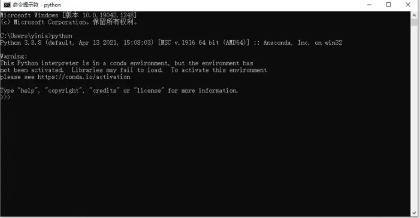
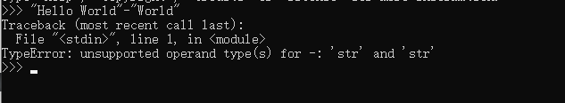
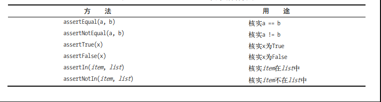

# Python语言基础 汇总

# Python语言：环境搭建

Python语言有着两个版本：

1. Python 2.x
2. Python 3.x

虽然有部分的程序依旧采用了Python 2.x进行编写，但是我们主要采用Python 3.x 进行编程。

在搜索引擎中搜索Python便可以找到Python官网，在Python官网中就可以对Python进行下载：


安装完成之后，可以通过CMD来查看是否安装成功和是否将Python加入到了Path中：



这里推荐使用的IDE是Pycharm编译器：


对于新人而言只需要使用社区版就可以了。


# Python语言：变量和简单数据类型

## 变量与命名规则

我们首先编写一个 HelloWorld.py文档，并且让程序输出Hello World：

```python
print("Hello World")
```


输出的结果为：

```python
Hello World
```


或者我们也可以这么写：

```python
message = "Hello World"
print(message)
```


运行的结果为：

```python
Hello World
```


对于HelloWorld.py文档而言，HelloWorld是文件的名称，而.py则标注了文件的类型，.py指出了这是一个Python语言文件。

在第二个例子中，message是一个变量；=号意味着赋值，将=号的右边的值赋值到等号的左边的变量中；而“Hello World”则是复制的具体的内容。

print()则是一个Python语言内置的function，能够将括号中的内容打印出来。

在Python语言中，变量的名称需要遵守这些基本的规则，如果违反这些规则，则将会引发错误：

1. 变量名只能包含字母、数字和下划线。变量名可以字母或下划线打头，但不能以数字打头，例如，可将变量命名为message_1，但不能将其命名为1_message。
2. 变量名不能包含空格，但可使用下划线来分隔其中的单词。例如，变量名greeting_message可行，但变量名greetingmessage会引发错误。
3. 不要将Python关键字和函数名用作变量名，即不要使用Python保留用于特殊用途的单词，如print。
4. 变量名应既简短又具有描述性。例如，name比n好，student_name比s_n好，name_length比length_of_persons_name好。
5. 慎用小写字母l和大写字母O，因为它们可能被人错看成数字1和0。

如果想要知道Python语言都有那些keyword，我们可以通过导入keyword这一个modules来进行查询：

```python
import keyword
print(keyword.kwlist)
```


运行的结果为：

```python
['False', 'None', 'True', 'and', 'as', 'assert', 'async', 
'await', 'break', 'class', 'continue', 'def', 'del', 'elif', 
'else', 'except', 'finally', 'for', 'from', 'global', 
'if', 'import', 'in', 'is', 'lambda', 
'nonlocal', 'not', 'or', 'pass', 'raise', 
'return', 'try', 'while', 'with', 'yield']
```


## 字符串

字符串便是一串字符，在Python语言中，可以用单引号进行表示，也可以使用双引号进行表示：

```python
"Hello World"

'Hello World'
```


这两者实际上是同一回事。

在Python语言中，字符串可以简单的通过+号来进行合并：

```python
first_name = "John"
last_name = "Smith"
full_name = first_name +" "+ last_name
print(full_name)
```


运行的结果为：

```python
John Smith
```


但是我们并不能够通过-号来进行删减，如果我们这么做，则会报错：



不过我们可以通过使用*号来输出制定数量的字符串：

```python
message = "Hello"
message*5
```


运行的结果为：

```python
'HelloHelloHelloHelloHello'
```


可以发现message变量中的内容被输出了五次。

Python语言为string内置了许多function，这里介绍一些常用的function和对这些function进行演示。

Python isalnum() 方法检测字符串是否由字母和数字组成，如果 string 至少有一个字符并且所有字符都是字母或数字则返回 True,否则返回 False，语法为：

```python
str.isalnum()
```


例子为：

```python
str = "abc"
print(str.isalnum())

str = "abc abc"
print(str.isalnum())
```


输出的结果为：

```python
True
False
```


Python isalpha() 方法检测字符串是否只由字母组成，如果字符串至少有一个字符并且所有字符都是字母则返回 True，否则返回 False，语法为：

```python
str.isalpha()
```


例子如下所示：

```python
str = "runoob";
print str.isalpha();

str = "runoob菜鸟教程";
print str.isalpha();

str = "this is string example....wow!!!";
print str.isalpha();
```


运行的结果为：

```python
True
False
False
```


Python isdecimal() 方法检查字符串是否只包含十进制字符。这种方法只存在于unicode对象。如果字符串是否只包含十进制字符返回True，否则返回False。

例子如下所示：

```python
str = u"this2009";  
print str.isdecimal();

str = u"23443434";
print str.isdecimal();
```


运行的结果为：

```python
False
True
```


Python isspace() 方法检测字符串是否只由空格组成。如果字符串中只包含空格，则返回 True，否则返回 False。isspace()方法语法：

```
str.isspace()
```


一个例子为：

```
#!/usr/bin/python

str = "       ";
print str.isspace();

str = "This is string example....wow!!!";
print str.isspace();
```


这个例子的输出结果为：

```
True
False
```


Python lower() 方法转换字符串中所有大写字符为小写。返回将字符串中所有大写字符转换为小写后生成的字符串。

lower()方法语法：

```
str.lower()
```


例子为：

```python
str = "THIS IS STRING EXAMPLE....WOW!!!";

print str.lower();
```


输出的结果为：

```python
this is string example....wow!!!
```


Python title() 方法返回"标题化"的字符串,就是说所有单词都是以大写开始，其余字母均为小写(见 istitle())。返回"标题化"的字符串,就是说所有单词都是以大写开始。title()方法语法：

```
str.title();
```


例子为：

```python
str = "this is string example....wow!!!";
print str.title();
```


以上实例输出结果如下：

```
This Is String Example....Wow!!!
```


Python upper() 方法将字符串中的小写字母转为大写字母。返回小写字母转为大写字母的字符串。upper()方法语法：

```
str.upper()
```


一个例子：

```python
str = "this is string example....wow!!!";

print "str.upper() : ", str.upper()
```


结果为：

```python
str.upper() :  THIS IS STRING EXAMPLE....WOW!!!
```


## 数字

数字可以使用+，-，*，/，四个符号来进行简单的四则运算：

```python
print(10+10)
print(10-10)
print(10*10)
print(10/10)
```


结果如下所示：

```python
20
0
100
1.0
```


Python还支持幂运算：

```python
print(10**2)
```


运行的结果为：

```python
100
```


在使用数字的时候，我们需要避免类型出错误：

```python
age = 23
message = "Happy " + age + "rd Birthday!"
print(message)
```


运行的结果为：

```python
Traceback (most recent call last):
File "birthday.py", line 2, in <module>
message = "Happy " + age + "rd Birthday!"
TypeError: Can't convert 'int' object to str implicitly
```


这是因为对于age这个变量，python面领着字符串和数字两种情况，在这样的情况之下，python无法进行分辨，所以报错。

我们需要做的是将int类型转换为string类型：

```python
age = 23
message = "Happy " + str(age) + "rd Birthday!"
print(message)
```


运行的结果为：

```python
Happy 23rd Birthday!
```


Python同样的为数字提供了大量的内置函数。

abs() 函数返回数字的绝对值。函数返回x（数字）的绝对值。

以下是 abs() 方法的语法:

```
abs( x )
```


以下展示了使用 abs() 方法的实例：

```python
print "abs(-45) : ", abs(-45)
print "abs(100.12) : ", abs(100.12)
print "abs(119L) : ", abs(119L)
```


以上实例运行后输出结果为：

```
abs(-45) :  45
abs(100.12) :  100.12
abs(119L) :  119
```


ceil() 函数返回数字的上入整数。函数返回数字的上入整数。

以下是 ceil() 方法的语法:

```
import math

math.ceil( x )
```


以下展示了使用 ceil() 方法的实例：

```python
import math   # This will import math module

print "math.ceil(-45.17) : ", math.ceil(-45.17)
print "math.ceil(100.12) : ", math.ceil(100.12)
print "math.ceil(100.72) : ", math.ceil(100.72)
print "math.ceil(119L) : ", math.ceil(119L)
print "math.ceil(math.pi) : ", math.ceil(math.pi)
```


以上实例运行后输出结果为：

```
math.ceil(-45.17) :  -45.0
math.ceil(100.12) :  101.0
math.ceil(100.72) :  101.0
math.ceil(119L) :  119.0
math.ceil(math.pi) : 4.0
```


cmp(x,y) 函数用于比较2个对象，如果 x < y 返回 -1, 如果 x == y 返回 0, 如果 x > y 返回 1。

以下是 cmp() 方法的语法:

```
cmp( x, y )
```


以下展示了使用 cmp() 方法的实例：

```
print "cmp(80, 100) : ", cmp(80, 100)
print "cmp(180, 100) : ", cmp(180, 100)
print "cmp(-80, 100) : ", cmp(-80, 100)
print "cmp(80, -100) : ", cmp(80, -100)
```


以上实例运行后输出结果为：

```
cmp(80, 100) :  -1
cmp(180, 100) :  1
cmp(-80, 100) :  -1
cmp(80, -100) :  1
```


exp() 方法返回x的指数，e^x。

以下是 exp() 方法的语法:

```
import math

math.exp( x )
```


以下展示了使用 exp() 方法的实例：

```
import math   # 导入 math 模块

print "math.exp(-45.17) : ", math.exp(-45.17)
print "math.exp(100.12) : ", math.exp(100.12)
print "math.exp(100.72) : ", math.exp(100.72)
print "math.exp(119L) : ", math.exp(119L)
print "math.exp(math.pi) : ", math.exp(math.pi)
```


以上实例运行后输出结果为：

```
math.exp(-45.17) :  2.41500621326e-20
math.exp(100.12) :  3.03084361407e+43
math.exp(100.72) :  5.52255713025e+43
math.exp(119L) :  4.7978133273e+51
math.exp(math.pi) :  23.1406926328
```


max() 方法返回给定参数的最大值，参数可以为序列。

以下展示了使用 max() 方法的实例：

```python
print "max(80, 100, 1000) : ", max(80, 100, 1000)
print "max(-20, 100, 400) : ", max(-20, 100, 400)
print "max(-80, -20, -10) : ", max(-80, -20, -10)
print "max(0, 100, -400) : ", max(0, 100, -400)
```


以上实例运行后输出结果为：

```
max(80, 100, 1000) :  1000
max(-20, 100, 400) :  400
max(-80, -20, -10) :  -10
max(0, 100, -400) :  100
```


min() 方法返回给定参数的最小值，参数可以为序列。

以下是 min() 方法的语法:

```
min( x, y, z, .... )
```


以下展示了使用 min() 方法的实例：

```
print "min(80, 100, 1000) : ", min(80, 100, 1000)
print "min(-20, 100, 400) : ", min(-20, 100, 400)
print "min(-80, -20, -10) : ", min(-80, -20, -10)
print "min(0, 100, -400) : ", min(0, 100, -400)
```


以上实例运行后输出结果为：

```
min(80, 100, 1000) :  80
min(-20, 100, 400) :  -20
min(-80, -20, -10) :  -80
min(0, 100, -400) :  -400
```


pow() 方法返回 x^y（x 的 y 次方） 的值。

以下是 math 模块 pow() 方法的语法:

```
import math

math.pow( x, y )
```


以下展示了使用 pow() 方法的实例：

```python
import math   # 导入 math 模块
 
print "math.pow(100, 2) : ", math.pow(100, 2)
# 使用内置，查看输出结果区别
print "pow(100, 2) : ", pow(100, 2)
 
print "math.pow(100, -2) : ", math.pow(100, -2)
print "math.pow(2, 4) : ", math.pow(2, 4)
print "math.pow(3, 0) : ", math.pow(3, 0)
```


以上实例运行后输出结果为：

```
math.pow(100, 2) :  10000.0
pow(100, 2) :  10000
math.pow(100, -2) :  0.0001
math.pow(2, 4) :  16.0
math.pow(3, 0) :  1.0
```


sqrt() 方法返回数字x的平方根。

以下是 sqrt() 方法的语法:

```
import math

math.sqrt( x )
```


以下展示了使用 sqrt() 方法的实例：

```
import math   # This will import math module

print "math.sqrt(100) : ", math.sqrt(100)
print "math.sqrt(7) : ", math.sqrt(7)
print "math.sqrt(math.pi) : ", math.sqrt(math.pi)
```


以上实例运行后输出结果为：

```
math.sqrt(100) :  10.0
math.sqrt(7) :  2.64575131106
math.sqrt(math.pi) :  1.77245385091
```


## 如何写注释

Python中的注释有单行注释和多行注释。

Python中单行注释以 **#** 开头，例如：：

```python
# 这是一个注释
print("Hello, World!")
```


多行注释用三个单引号 **'''** 或者三个双引号 **"""** 将注释括起来。

单引号（'''）

```python
'''
这是多行注释，用三个单引号
这是多行注释，用三个单引号 
这是多行注释，用三个单引号
'''
print("Hello, World!")
```


双引号（"""）

```python
"""
这是多行注释，用三个双引号
这是多行注释，用三个双引号 
这是多行注释，用三个双引号
"""
print("Hello, World!")
```


## Python之禅

经验丰富的程序员倡导尽可能避繁就简。Python社区的理念都包含在Tim Peters撰写的“Python之禅”中。要获悉这些有关编写优秀Python代码的指导原则，只需在解释器中执行命令import this。

```python
import this
```


运行的结果为：

```python
The Zen of Python, by Tim Peters

Beautiful is better than ugly.
Explicit is better than implicit.
Simple is better than complex.
Complex is better than complicated.
Flat is better than nested.
Sparse is better than dense.
Readability counts.
Special cases aren't special enough to break the rules.
Although practicality beats purity.
Errors should never pass silently.
Unless explicitly silenced.
In the face of ambiguity, refuse the temptation to guess.
There should be one-- and preferably only one --obvious way to do it.
Although that way may not be obvious at first unless you're Dutch.
Now is better than never.
Although never is often better than *right* now.
If the implementation is hard to explain, it's a bad idea.
If the implementation is easy to explain, it may be a good idea.
Namespaces are one honking great idea -- let's do more of those!
```


# Python语言：列表

## 列表与列表的访问

列表是由一系列按照特定顺序排列的元素组成。

在Python中，用方括号[]来表示列表，并用逗号来分隔其中的元素。

一下是一个简单的例子：

```python
studentName = ["aaa", "bbb", "ccc"]
```


我们可以用直接打印的方式打印出来列表中的内容：

```python
['aaa', 'bbb', 'ccc']
```


可见直接打印将会将列表以整个列表的形式打印出来，包括了[]和""。

我们可以通过元素所在的位置的方式来对列表中的某一个元素进行访问：

```python
studentName = ["aaa", "bbb", "ccc"]
print(studentName[1])
```


运行的结果为：

```python
bbb
```


这是因为对于Python语言而言，索引是从0开始而不是从1开始的。

如果我们想要访问的是我们日常生活中所认为的第一个元素，那么我们需要制定的索引是0：

```python
studentName = ["aaa", "bbb", "ccc"]
print(studentName[0])
```


运行的结果为：

```python
aaa
```


如果我们想要访问的是列表中的最后一个元素，则可以直接使用-1作为索引值：

```python
studentName = ["aaa", "bbb", "ccc"]
print(studentName[-1])
```


运行的结果为：

```python
ccc
```


我们可以在访问列表的值的同时使用该值进行赋值：

```python
studentName = ["aaa", "bbb", "ccc"]
message = "The first student's name is :" + studentName[0]
print(message)
```


运行的结果为：

```python
The first student's name is :aaa
```


## 修改，添加和删除元素

列表的使用大多数是动态的，列表被创建之后还会出现删除，修改，增添等操作。

如果我们要修改列表的某一个元素，我们可以指定列表名和需要被修改的元素的索引，再指定该元素的新值：

```python
studentName = ["aaa", "bbb", "ccc"]
studentName[0] = "aaac"
print(studentName)
```


运行的结果为：

```python
['aaac', 'bbb', 'ccc']
```


如果我们要做的是添加新值，则可以采用append()函数来在末尾进行添加：

```python
studentName = ["aaa", "bbb", "ccc"]
studentName.append("ddd")
print(studentName)
```


运行的结果为：

```python
['aaa', 'bbb', 'ccc', 'ddd']
```


我们其实也可以先创建一个空列表，然后再通过一系列的append()语句来添加元素，例子如下所示：

```python
studentName = []
studentName.append("aaa")
studentName.append("bbb")
studentName.append("ccc")

print(studentName)
```


运行的结果为：

```python
['aaa', 'bbb', 'ccc']
```


但是还有一种情况是，我们并不是在列表的末尾插入一个新的元素，而是需要在列表的指定位置插入一个新的元素，这个时候我们就需要用到insert()函数了：

```python
studentName = ['aaa', 'bbb', 'ddd']
studentName.insert(2, "ccc")

print(studentName)
```


运行的结果为：

```python
['aaa', 'bbb', 'ccc', 'ddd']
```


insert()函数的语法如下所示：

```python
insert(positionValue, elementValue)
```


positionValue表示的是插入的索引位置，而elementValue表示的是插入的元素的值。

如果我们需要做的是从既有的列表中删除某一个指定的元素，那么我们可以使用del语句来进行删除：

```python
studentName = ['aaa', 'bbb', 'ddd']
del studentName[0]

print(studentName)
```


运行的结果为：

```python
['bbb', 'ddd']
```


需要注意的是，如果我们使用的是del语句来进行删除，那么被删除的值就无法在被访问了。

有些时候我们需要将一个值从列表中删除，但是同时我们还需要使用到这个值，这个时候我们就可以使用pop()函数来进行：

```python
StudentListOne = ["L11", "L12", "L13"]
StudentListTwo = ["L21"]

StudentListTwo.append(StudentListOne.pop())

print(StudentListTwo)
print(StudentListOne)
```


在这里，我们将StudenListOne这一列表中的最后一个元素弹出，并且使用这个被弹出的元素的值，然后通过append()函数来讲其添加到StudentListTwo这一列表的末尾。

当然pop()函数不仅仅是能够弹出列表末尾的元素，只需要在括号中添加元素的索引位置，便可以弹出指定位置的元素：

```python
StudentListOne = ["L11", "L12", "L13"]
StudentListTwo = ["L21"]

StudentListTwo.append(StudentListOne.pop(0))

print(StudentListTwo)
print(StudentListOne)
```


运行的结果为：

```python
['L21', 'L11']
['L12', 'L13']
```


有些时候我们并不清楚需要被弹出的元素的具体的索引位置，但是我们知道需要被弹出的元素的具体的值，这个时候我们就可以使用remove()函数来进行操作：

```python
StudentListOne = ["L11", "L12", "L13"]
StudentListOne.remove("L11")

print(StudentListOne)
```


运行的结果为：

```python
['L12', 'L13']
```


不过需要注意的是，remove()函数只会删除列表中第一个与制定值相符合的元素，如果存在着多个与指定值相符合的元素，则需要通过反复的调用remove()函数来进行删除：

```python
StudentListOne = ["L11", "L12", "L13", "L11"]
StudentListOne.remove("L11")

print(StudentListOne)
```


运行的结果为：

```python
['L12', 'L13', 'L11']
```


如果我们想要对列表进行排序，则可以使用sort()函数进行实现：

```python
StudentListOne = ["L13", "L12", "L11"]
StudentListOne.sort()

print(StudentListOne)
```


运行的结果为：

```python
['L11', 'L12', 'L13']
```


如果我们需要的是逆向排序，则需要向sort()函数传递reverse=True作为参数值：

```python
StudentListOne = ["L13", "L12", "L11"]
StudentListOne.sort(reverse=True)

print(StudentListOne)
```


运行的结果为：

```python
['L13', 'L12', 'L11']
```


还有一些特殊的情况，那就是我们并不想要改变列表中元素的排序，但是同时我们想要获得列表中的元素被排序之后的结果：

```python
StudentListOne = ["L13", "L12", "L11"]

print(sorted(StudentListOne))
print(StudentListOne)
```


运行的结果为：

```python
['L11', 'L12', 'L13']
['L13', 'L12', 'L11']
```


可以使用sorted()进行操作并没有改变原来的列表的值。

如果我们想要反转列表中的元素，则可以使用reverse()函数来进行实现：

```python
StudentListOne = ["L13", "L12", "L11"]
StudentListOne.reverse()

print(StudentListOne)
```


运行的结果为：

```python
['L11', 'L12', 'L13']
```


需要注意的是，reverse()函数是永久的改变了列表中的元素的排列，当然我们可以再次使用reverse()函数，从而是列表中的元素回到原来的排列。

## 遍历整个列表

如果我们需要将列表中的每一个元素分别打印出来，这个时候我们就可以使用for循环来进行实现：

```python
studentName = ["aaa","bbb","ccc","ddd"]
for student in studentName:
    print(student)
```


运行的结果为：

```python
aaa
bbb
ccc
ddd
```


在这一个例子中使用到了for循环，for X in Xs可以被理解为对于在Xs中的每一个X而言。Xs是一个列表，但是X仅仅是一个临时变量，所以X的名称并不重要，只需要不与其他的变量的名称相互重合。

相对于其他的编程语言通过（）或者｛｝来进行标注，Python语言使用缩进来进行表示，有着相同缩进的代码是同一个代码块。

不要遗漏冒号。

## 创建数值列表

如果我们需要生成一系列的数字，那么我们可以使用range()函数来进行：

```python
for value in range(5):
    print(value)
```


运行的结果为：

```python
0
1
2
3
4
```


通过输出的结果不难发现：

1. Python语言是从0开始生成数字的
2. 括号中的数字并不会被生成

如果我们希望从1开始生成，那么我们就需要制定初始生成值：

```python
for value in range(1,5):
  print(value)
```


结果为：

```python
1
2
3
4
```


如果我们希望包含数值我，那么我们给出的结束值需要是6：

```python
for value in range(1,6):
  print(value)
```


运行的结果为：

```python
1
2
3
4
6
```


当我们通过range()函数生成了一组数字之后，我们可以使用list()函数将其转换为一个列表：

```python
numbers = list(range(1,6))
print(numbers)
```


运行的结果为：

```python
[1, 2, 3, 4, 5]
```


或者我们也可以制定步长：

```python
even_numbers = list(range(2,11,2))
print(even_numbers)
```


运行的结果为：

```python
[2, 4, 6, 8, 10]
```


函数range()从2开始数，然后不断地加2，直到达到或超过终值（11）。

我们也可以将range()函数和append()函数相互结合来生成列表：

```python
squares = []
for value in range(1,11):
  square = value**2
  squares.append(square)

print(squares)
```


输出的结果为：

```python
[1, 4, 9, 16, 25, 36, 49, 64, 81, 100]
```


对于数字列表，有着min()，max()和sum()三个简单的函数来对其进行处理：

```python
digits = [1, 2, 3, 4, 5, 6, 7, 8, 9, 0]
print(min(digits))
print(max(digits))
print(sum(digits))
```


运行的结果为：

```python
0
9
45
```


## 获得部分列表

与range()函数一样，我们可以通过指定第一个元素和最后一个元素的索引，来获得一个列表的切片：

```python
players = ['charles', 'martina', 'michael', 'florence', 'eli']
print(players[0:3])
```


运行的结果为：

```python
['charles', 'martina', 'michael']
```


可以发现无论是range()还是[]切片，实际上都是采用左闭右开的原则，即包括左边的数值，但是不包括右边的数值。

同样的我们还可以将切片和循环组合使用：

```python
players = ['charles', 'martina', 'michael', 'florence', 'eli']
print("Here are the first three players on my team:")
for player in players[:3]: 
  print(player.title())
```


运行的结果为：

```python
Here are the first three players on my team:
Charles
Martina
Michael
```


要复制列表，可创建一个包含整个列表的切片，方法是同时省略起始索引和终止索引（[:]）：

```python
my_foods = ['pizza', 'falafel', 'carrot cake']
friend_foods = my_foods[:]

print("My favorite foods are:")
print(my_foods)

print("\nMy friend's favorite foods are:")
print(friend_foods)
```


运行的结果为：

```python
My favorite foods are:
['pizza', 'falafel', 'carrot cake']

My friend's favorite foods are:
['pizza', 'falafel', 'carrot cake']
```


# Python语言：元组

Python 的元组与列表类似，不同之处在于元组的元素不能修改。

元组创建很简单，只需要在括号中添加元素，并使用逗号隔开即可。

```python
tup1 = ('aaa', 'bbb', 1997, 2000)
tup2 = (1, 2, 3, 4, 5 )
tup3 = "a", "b", "c", "d" 

print(type(tup1))
print(type(tup2))
print(type(tup3))
```


运行的结果为：

```python
<class 'tuple'>
<class 'tuple'>
<class 'tuple'>
```


不过元组中的元素虽然不能够被删除，但是我们可以将两个元组组合成为一个新的元组：

```python
tup1 = ('aaa', 'bbb', 1997, 2000)
tup2 = (1, 2, 3, 4, 5 )
tup3 = "a", "b", "c", "d" 

print(tup1+tup2)
```


运行结果为：

```python
('aaa', 'bbb', 1997, 2000, 1, 2, 3, 4, 5)
```


当然我们也能够删除掉整个元组：

```python
tup = ('aaa', 'bbb')
 
print (tup)
del tup
print ("删除后的元组 tup : ")
print (tup)
```


运行的结果为：

```python
删除后的元组 tup : 
Traceback (most recent call last):
  File "test.py", line 8, in <module>
    print (tup)
NameError: name 'tup' is not defined
```


输出变量会有异常信息。

如果我们有需求，我们也可以将列表转换为元组：

```python
list1= ['Google', 'Taobao', 'Runoob', 'Baidu']
tuple1=tuple(list1)
print(tuple1)
```


# Python语言：if语句

## if语句

每条if语句的核心都是一个值为True或False的表达式，这种表达式被称为条件测试。Python 根据条件测试的值为True还是False来决定是否执行if语句中的代码。如果条件测试的值为True，Python就执行紧跟在if语句后面的代码；如果为False，Python就忽略这些代码。

要判断是否相等，我们可以使用==来进行判断：

```python
car = 'Audi'
car.lower() == 'audi'
```


输出的结果为：

```python
true
```


比如说我们在测试用户的用户名是否与他人重合的时候我们可以使用到这个判断。 

要判断两个值是否不等，可结合使用惊叹号和等号（!=），其中的惊叹号表示不，在很多编程语言中都如此：

```python
requested_topping = 'mushrooms'
if requested_topping != 'anchovies':
  print("Hold the anchovies!")
```


输出的结果为：

```python
Hold the anchovies!
```


如果需要对多个条件进行比较，则可以使用and和or两个符号：

```python
num1 = 15
num2 = 20

num3 = 25
num4 = 30

if num1 == 15 and num2 == 20:
  print("All Right")

if num3 == 25 or num4 == 40:
  print("One of them is right")
```


and需要多个条件同时成立才能够成立，而or只需要一个条件成立就能够成立。

## if-else语句

最简单的if语句只有一个测试和一个操作，但是使用了if-else语句之后便可以有两个操作：

```python
num = 50

if num < 60:
  print("不及格")
else:
  print("及格了")
```


输出的结果为：

```python
不及格
```


if-else语句可以演变为if-elif-else语句，用来执行2个以上的条件判断对执行对应的操作：

```python
num = 85

if num < 60:
  print("不及格")
elif 60<=num and num<=80:
  print("及格")
else:
  print("优秀")
```


运行的结果为：

```python
优秀
```


## 用if语句来处理列表

我们可以把if语句和列表相结合：

```python
food_list = ['apple', 'banana','orange']

for food in food_list:
  if food == 'apple':
    print("Apple is here")
  elif food == 'bana':
    print("Banana is here")
  else:
    print("Orange is here")
```


输出的结果为：

```python
Apple is here
Orange is here
Orange is here
```


或者我们可以用来检测列表是否为空：

```python
requested_toppings = []
if requested_toppings:
  for requested_topping in requested_toppings:
    print("Adding " + requested_topping + ".")
  print("\nFinished making your pizza!")
else:
  print("Are you sure you want a plain pizza?")
```


运行结果为：

```python
Are you sure you want a plain pizza?
```


Python语言会在列表至少包含一个元素的时候返回True，而列表为空的是否返回False。

当我们有着多个列表的时候，我们可以：

```python
available_toppings = ['mushrooms', 'olives', 'green peppers','pepperoni', 'pineapple', 'extra cheese']
requested_toppings = ['mushrooms', 'french fries', 'extra cheese']

for requested_topping in requested_toppings:
  if requested_topping in available_toppings:
    print("Adding " + requested_topping + ".")
  else:
    print("Sorry, we don't have " + requested_topping + ".")
  print("\nFinished making your pizza!")
```


运行结果为：

```python
Adding mushrooms.

Finished making your pizza!
Sorry, we don't have french fries.

Finished making your pizza!
Adding extra cheese.

Finished making your pizza!
```


# Python语言：字典

## 创建与访问

字典是一种可变容器模型，且可存储任意类型对象。

键一般是唯一的，如果重复最后的一个键值对会替换前面的，值不需要唯一。

值可以取任何数据类型，但键必须是不可变的，如字符串，数字或元组。

我们可以生成一个字典来存储学生信息：

```python
student_information = {'s111':'John', 's112':'Harry', 'a113':'Joe'}
print(student_information["a113"])

student = student_information["s111"]
print(student)
```


运行的结果为：

```python
Joe
John
```


## 使用字典

要添加键—值对，可依次指定字典名、用方括号括起的键和相关联的值。

例子为：

```python
student_information = {'s111':'John', 's112':'Harry', 'a113':'Joe'}
student_information['s114'] = "Smith"

print(student_information['s114'])
```


运行的结果为：

```python
Smith
```


需要注意的是，对于字典而言，字典中的键值对不存在着位置，也就是说我们并不能够通过索引来访问键值对。

要修改字典中的值，可依次指定字典名、用方括号括起的键以及与该键相关联的新值。

```python
student_information = {'s111':'John', 's112':'Harry', 'a113':'Joe'}
student_information['s111'] = 'Jobs'

print(student_information['s111'])
```


运行的结果为：

```python
Jobs
```


如果要删除，则可以使用del语句来进行删除：

```python
student_information = {'s111':'John', 's112':'Harry', 'a113':'Joe'}
print(student_information)

del student_information['s111']
print(student_information)
```


运行的结果为：

```python
{'s111': 'John', 's112': 'Harry', 'a113': 'Joe'}
{'s112': 'Harry', 'a113': 'Joe'}
```


## 遍历字典

如果我们想要遍历字典，我们同样可以采取for循环来遍历所有的键值对：

```python
user_0 = {
  'username': 'efermi',
  'first': 'enrico',
  'last': 'fermi',
 }
for key, value in user_0.items():
  print("\nKey: " + key)
  print("Value: " + value)
```


运行的结果为：

```python
Key: username
Value: efermi

Key: first
Value: enrico

Key: last
Value: fermi
```


如果我们并不需要遍历所有的键值，而是仅仅需要遍历所有的值，那么我们可以使用keys()函数来实现：

```python
user_0 = {
  'username': 'efermi',
  'first': 'enrico',
  'last': 'fermi',
 }

for user in user_0.keys():
  print(user.title())
```


运行的结果为：

```python
Username
First
Last
```


# Python语言：用户输入和while循环

## input()输入

函数input()让程序暂停运行，等待用户输入一些文本。获取用户输入后，Python将其存储在一个变量中，以方便你使用。

以下就是一个简单的例子：

```python
message = intpu("Enter 'Hello World'")
print(message)
```


运行的结果为：

```python
Enter 'Hello World'Hello World
Hello World
```


input()函数会接受一个参数，不过需要想用户进行说明，让用户知道需要输入什么。

有些情况之下我们需要用户输入一个数字，这个时候我们需要使用int()来讲输入的内容转换为int类型：

```python
number = int(input("Please enter a number here: "))

print(number)
```


运行的结果为：

```python
Please enter a number here: 123321
123321
```


如果我们不适用int()来完成类型的转变，那么我们输入的数字实际上是string类型，而不是int类型。

## while循环

for循环用于针对集合中的每个元素都一个代码块，而while循环不断地运行，直到指定的条件不满足为止。

我们可以使用while循环来数数，比如说：

```python
current_number = 1
while current_number <= 5:
  print(current_number)
  current_number += 1
```


我们首先生成了一个名为current_number的数字，并且将其设置为1；以这个数字为flag，我们进行了一个循环，循环的终止条件为current_number≤5；当这个条件成立的时候，便会执行while代码块中的代码，代码有两行，第一行是打印当前的数字，第二行是将当前的数字的值+1；第二行的代码非常的重要，因为每进行以此循环，数值便会变大一个，如此current_number的值最终便会达到5，这时候while循环的条件判断便会不成立，如此循环便会终止。

通过循环，我可以选择让用户决定何时退出：

```python
message  = ""

while message !="000":
  print("Type something here and i weill repeat it back: ")
  print("\n If you type 000, it will end that program.")
  message = input()
  print(message)
```


运行的结果为

```python
Type something here and i weill repeat it back:

If you type end, it will end that program.
123321
123321
Type something here and i weill repeat it back:

If you type end, it will end that program.
qwerreqw
qwerreqw
Type something here and i weill repeat it back:

If you type end, it will end that program.
end
end
```


但是这个程序有着一个问题，就是会将end也打印出来：

我们可以通过增加if判断语句来消除这个问题：

```python
message  = ""

while message !="end":
  print("Type something here and i weill repeat it back: ")
  print("\nIf you type end, it will end that program.")
  message = input()
  
  if message != "end":
    print(message)
```


运行的结果为：

```python
Type something here and i weill repeat it back:

If you type end, it will end that program.
qwerreq
qwerreq
Type something here and i weill repeat it back:

If you type end, it will end that program.
end
```


在一些复杂的程序中，许多不同的事情会导致程序停止运行，再这样的情况之下我们可以设置一个标志，这个标志可以用来判断整个程序是否处于活动状态，当标志为true的时候会继续运行，而当标志为false的时候程序便会停止运行。

例子如下所示：

```python
prompt = "\nTell me something, and I will repeat it back to you:"
prompt += "\nEnter 'quit' to end the program. "

active = True
while active:

  message = input(prompt)

  if message == 'quit':
    active = False
  else:
    print(message)
```


我们先将active设置为了True，如此程序最开始会处于活动状态，这样做简化了while语句，因为不需要在其中做任何的比较，相关的逻辑由程序的其他部分处理，只要将变量active为True，循环就可以继续运行。

如果我们需要立即退出while循环，并且不在运行循环中的剩余的代码，也无论条件测试的结果如何，那么我们可以使用break语句，break语句可以用来控制程序流程，可以使用它来控制哪些代码将执行，哪些代码不执行，从而让程序按照要求执行代码：

```python
prompt = "\nPlease enter the name of a city you have visited:"
prompt += "\n(Enter 'quit' when you are finished.) "
while True:
  city = input(prompt)
  if city == 'quit':
    break
  else:
    print("I'd love to go to " + city.title() + "!")
```


运行如下所示：

```python
Please enter the name of a city you have visited:
(Enter 'quit' when you are finished.) New York
I'd love to go to New York!

Please enter the name of a city you have visited:
(Enter 'quit' when you are finished.) San Francisco
I'd love to go to San Francisco!

Please enter the name of a city you have visited:
(Enter 'quit' when you are finished.) quit
```


实际上在Python的任何循环中都可以使用break语句，不单纯的是for循环，if语句，for语句中都可以使用break语句来直接退出。

如果我们希望不再执行接下来的语句，但是也不直接退出循环，而是回到循环的开头先做一次循环判断，那么我们可以使用continue语句：

```python
current_number = 0
while current_number < 10:
  current_number += 1
  if current_number % 2 == 0:
    continue
  
  print(current_number)
```


运行的结果为：

```python
1
3
5
7
9
```


# Python语言：函数

## 定义函数

以下是一个打印问候语的简单函数，函数名称为greet)user():

```python
def greet_user():
  """用来显示简单的问候语"""
  print("Hello Users!")

greet_user()
```


运行的结果为：

```python
Hello Users!
```


def是definition的缩写，def关键字会告诉Python我们要定义一个函数，这就是函数定义；greet_user()则是函数的名称，默认为无参数，但是可以添加参数来为之后的代码提供信息；而结尾则是:冒号；在这之后则是"""xxxx"""，这里的文本是文档字符串的注释，用来描述函数是用来做什么的，需要用三个引号（单引号或者双引号都可以）来标明；这之后面试代码，代码在函数被调用的时候会被执行。

最后greet_user()则是对函数的调用，注意不要遗漏()，如果仅仅是greet_user则不是对这个函数的调用。

我们可以想函数传递一个参数，让函数打印出来这个参数：

```python
def greet_user(user_name):
  """用来显示简单的问候语"""
  print("Hello Users!"+ " " + user_name)

user_name = input("Please enter a number here: ")
greet_user(user_name)
```


运行的结果为：

```python
Please enter a number here: John
Hello Users! John
```


在这里user_name是一个形式参数，因为这个参数的只是一个形式，用来指向被传递进来的数据，而John则是一个实际参数，实际参数是调用函数的时候传递给函数的信息。

## 实际参数

实际参数的第一种形式是位置实参：

```python
def describe_pet(animal_type, pet_name):
   """显示宠物的信息"""
   print("\nI have a " + animal_type + ".")
   print("My " + animal_type + "'s name is " + pet_name.title() + ".")

describe_pet('hamster', 'harry')
```


运行的结果为：

```
I have a hamster.
My hamster's name is Harry.
```


对于位置实参而言，顺序非常的重要，否则会：

```python
def describe_pet(animal_type, pet_name):
   """显示宠物的信息"""
   print("\nI have a " + animal_type + ".")
   print("My " + animal_type + "'s name is " + pet_name.title() + ".")

describe_pet('harry','hamster')
```


变成了：

```
I have a harry.
My harry's name is Hamster.
```


关键字实参则是给函数传递 名称-值 对：

```
def describe_pet(animal_type, pet_name):
  """显示宠物的信息"""
  print("\nI have a " + animal_type + ".")
  print("My " + animal_type + "'s name is " + pet_name.title() + ".")

describe_pet(animal_type='hamster', pet_name='harry')
```


运行的结果为：

```
I have a hamster.
My hamster's name is Harry.
```


调用这个函数时，我们向Python明确地指出了各个实参对应的形参。看到这个函数调用时，Python知道应该将实参'hamster'和'harry'分别存储在形参animal_type和pet_name中。

另一种情况是我们可以使用默认值，在编写函数的时候可以给每个形式参数指定默认值：

```
def describe_pet(pet_name, animal_type='dog'):
  """显示宠物的信息"""
  print("\nI have a " + animal_type + ".")
  print("My " + animal_type + "'s name is " + pet_name.title() + ".")
describe_pet(pet_name='willie')
```


运行的结果为：

```
I have a dog.
My dog's name is Willie.
```


## 返回值

函数并非总是直接显示输出，相反，它可以处理一些数据，并返回一个或一组值。

一下是一个函数：

```
def get_formatted_name(first_name, last_name):
  """返回整洁的姓名"""
  full_name = first_name + ' ' + last_name
  return full_name.title()
musician = get_formatted_name('jimi', 'hendrix')
print(musician)
```


运行的结果为：

```
Jimi Hendrix
```


我们也可以让实参变成可选的，以下是一个例子：

```
def get_formatted_name(first_name, middle_name, last_name):
  """返回整洁的姓名"""
  full_name = first_name + ' ' + middle_name + ' ' + last_name
  return full_name.title()

musician = get_formatted_name('john', 'lee', 'hooker')
print(musician)
```


运行的结果为：

```
John Lee Hooker
```


但是对于一些人而言没有middle_name，所以在这样的情况之下，我们可以这样写：

```
def get_formatted_name(first_name, last_name, middle_name=''):
  """返回整洁的姓名"""
  if middle_name:
    full_name = first_name + ' ' + middle_name + ' ' + last_name
  else:
    full_name = first_name + ' ' + last_name
  return full_name.title()

musician = get_formatted_name('jimi', 'hendrix')
print(musician)
musician = get_formatted_name('john', 'hooker', 'lee')
print(musician)
```


运行的结果为：

```
Jimi Hendrix
John Lee Hooker
```


## 传递列表

向函数传递列表很有用，这种列表包含的可能是名字、数字或更复杂的对象（如字典）。将列表传递给函数后，函数就能直接访问其内容。下面使用函数来提高处理列表的效率。

我们可以写一个这样的程序：

```
def greet_users(names):
  """向列表中的每位用户都发出简单的问候"""
  for name in names:
    msg = "Hello, " + name.title() + "!"
    print(msg)

usernames = ['hannah', 'ty', 'margot']
greet_users(usernames)
```


运行的结果为：

```
Hello, Hannah!
Hello, Ty!
Hello, Margot!
```


## 传递任意数量的实参

有些情况我们并不知道函数需要接受多少个实参，但是Python语言允许函数从调用语句中收集任意数量的实参。

这是一个例子：

```
def make_pizza(*toppings):
  """打印顾客点的所有配料"""
  print(toppings)

make_pizza('pepperoni')
make_pizza('mushrooms', 'green peppers', 'extra cheese')
```


形参名*toppings中的星号让Python创建一个名为toppings的空元组，并将收到的所有值都封装到这个元组中。

运行的结果为：

```
('pepperoni',)
('mushrooms', 'green peppers', 'extra cheese')
```


我们可以将print修改成一个循环语句：

```
def make_pizza(*toppings):
  """概述要制作的比萨"""
  print("\nMaking a pizza with the following toppings:")
  for topping in toppings:
    print("- " + topping)

make_pizza('pepperoni')
make_pizza('mushrooms', 'green peppers', 'extra cheese')
```


运行的结果为：

```
Making a pizza with the following toppings:
- pepperoni

Making a pizza with the following toppings:
- mushrooms
- green peppers
- extra cheese
```


## 将函数存储在模块中

要让函数是可导入的，得先创建模块。模块是扩展名为.py的文件，包含要导入到程序中的代码。

创建一个名为pizza.py的文件：

```
def make_pizza(size, *toppings):
"""概述要制作的比萨"""
  print("\nMaking a " + str(size) +
    "-inch pizza with the following toppings:")
  for topping in toppings:
    print("- " + topping)
```


然后我们可以创建另一个名为为making_pizzas.py的文件，然后在这个文件中导入刚才刚创建的模块：

```
import pizza
pizza.make_pizza(16, 'pepperoni')
pizza.make_pizza(12, 'mushrooms', 'green peppers', 'extra cheese')
```


运行的结果为：

```
Making a 16-inch pizza with the following toppings:
- pepperoni

Making a 12-inch pizza with the following toppings:
- mushrooms
- green peppers
- extra cheese
```


# Python语言：类

## 创建和使用类

我们可以创建Dog类，来存储名字和年龄，并且让每一条小狗有着蹲下和打滚的能力：

```
class Dog():
  """一次模拟小狗的简单尝试"""

  def __init__(self, name, age):
    """初始化属性name和age"""
    self.name = name
    self.age = age

  def sit(self):
    """模拟小狗被命令时蹲下"""
    print(self.name.title() + " is now sitting.")

  def roll_over(self):
    """模拟小狗被命令时打滚"""
    print(self.name.title() + " rolled over!")
```


首先我们用class来进行声明，class可以告诉Python语言这是类类型，需要注意的地方在于首字母需要大写；首先是__init__()方法，这是要给特殊的方法，当你根据Dog类创新实例时，Python都会自动运行它，需要注意的地方在于这里是两个下划线__，这是为了避免Python默认方法与普通方法发生名称冲突，**init__在这里包含了三个形式参数：self，name和age，形式参数self是必不可少的，并且需要在其他形式参数的前面。因为Python调用这个__init**()方法来创建Dog实例时，将自动传入实参self。每个与类相关联的方法调用都自动传递实参self，它是一个指向实例本身的引用，让实例能够访问类中的属性和方法。

初始化属性中，定义的两个变量都有前缀self。。以self为前缀的变量都可供类中的所有方法使用，我们还可以通过类的任何实例来访问这些变量。[self.name](http://self.name) = name获取存储在形参name中的值，并将其存储到变量name中，然后该变量被关联到当前创建的实例。

我们可以使用Dog类来生成一个实例试试看：

```
class Dog():
  """一次模拟小狗的简单尝试"""

  def __init__(self, name, age):
    """初始化属性name和age"""
    self.name = name
    self.age = age

  def sit(self):
    """模拟小狗被命令时蹲下"""
    print(self.name.title() + " is now sitting.")

  def roll_over(self):
    """模拟小狗被命令时打滚"""
    print(self.name.title() + " rolled over!")

my_dog = Dog('willie', 6)

print("My dog's name is " + my_dog.name.title() + ".")
print("My dog is " + str(my_dog.age) + " years old.")
```


运行的结果为：

```
My dog's name is Willie.
My dog is 6 years old.
```


我们首先用Dog()类来对my_dog进行了实例化，然后传递了willie和6两个实参；接着我们使用my_dog.name来访问my_dog中的name的值，同样的用这样的方法访问了my_dog中age的值。

如果我们想要的是调用方法，那么我们可以：

```
class Dog():
  """一次模拟小狗的简单尝试"""

  def __init__(self, name, age):
    """初始化属性name和age"""
    self.name = name
    self.age = age

  def sit(self):
    """模拟小狗被命令时蹲下"""
    print(self.name.title() + " is now sitting.")

  def roll_over(self):
    """模拟小狗被命令时打滚"""
    print(self.name.title() + " rolled over!")

my_dog = Dog('willie', 6)

print("My dog's name is " + my_dog.name.title() + ".")
print("My dog is " + str(my_dog.age) + " years old.")
my_dog.sit()
my_dog.roll_over()
```


运行的结果为：

```
My dog's name is Willie.
My dog is 6 years old.
Willie is now sitting.
Willie rolled over!
```


同样的我们还可以生成多个实例：

```
class Dog():
  """一次模拟小狗的简单尝试"""

  def __init__(self, name, age):
    """初始化属性name和age"""
    self.name = name
    self.age = age

  def sit(self):
    """模拟小狗被命令时蹲下"""
    print(self.name.title() + " is now sitting.")

  def roll_over(self):
    """模拟小狗被命令时打滚"""
    print(self.name.title() + " rolled over!")

my_dog = Dog('willie', 6)
your_dog = Dog('lucy', 3)
print("My dog's name is " + my_dog.name.title() + ".")
print("My dog is " + str(my_dog.age) + " years old.") 
my_dog.sit()
print("\nYour dog's name is " + your_dog.name.title() + ".")
print("Your dog is " + str(your_dog.age) + " years old.")
your_dog.sit()
```


运行的结果为：

```
My dog's name is Willie.
My dog is 6 years old.
Willie is now sitting.

Your dog's name is Lucy.
Your dog is 3 years old.
Lucy is now sitting.
```


## 使用类和实例

我们来实际的使用一下类。

我们首先生成一个表示汽车的类（Car）：

```
class Car():
  """一次模拟汽车的简单尝试"""

  def __init__(self, make, model, year):
    """初始化描述汽车的属性"""
    self.make = make
    self.model = model
    self.year = year

  def get_descriptive_name(self):
    """返回整洁的描述性信息"""
    long_name = str(self.year) + ' ' + self.make + ' ' + self.model
    return long_name.title()

my_new_car = Car('audi', 'a4', 2016)
print(my_new_car.get_descriptive_name())
```


运行的结果为：

```
2016 Audi A4
```


类中的每个属性都必须有初始值，哪怕这个值是0或空字符串。在有些情况下，如设置默认值时，在方法__init__()内指定这种初始值是可行的；如果对某个属性这样做了，就无需包含为它提供初始值的形参。

下面来添加一个名为odometer_reading的属性，其初始值总是为0。我们还添加了一个名为read_odometer()的方法，用于读取汽车的里程表：

```
class Car():
  """一次模拟汽车的简单尝试"""

  def __init__(self, make, model, year):
    """初始化描述汽车的属性"""
    self.make = make
    self.model = model
    self.year = year
    self.odometer_reading = 0

  def get_descriptive_name(self):
    """返回整洁的描述性信息"""
    long_name = str(self.year) + ' ' + self.make + ' ' + self.model
    return long_name.title()

  def read_odometer(self):
    """打印一条指出汽车里程的消息"""
    print("This car has " + str(self.odometer_reading) + " miles on it.")

my_new_car = Car('audi', 'a4', 2016)
print(my_new_car.get_descriptive_name()) 
my_new_car.read_odometer()
```


运行的结果为：

```
2016 Audi A4
This car has 0 miles on it.
```


要修改属性的值，最简单的方式是通过实例直接访问它。比如说我们可以将里程表读书设置为23：

```
class Car():
  """一次模拟汽车的简单尝试"""

  def __init__(self, make, model, year):
    """初始化描述汽车的属性"""
    self.make = make
    self.model = model
    self.year = year
    self.odometer_reading = 0

  def get_descriptive_name(self):
    """返回整洁的描述性信息"""
    long_name = str(self.year) + ' ' + self.make + ' ' + self.model
    return long_name.title()

  def read_odometer(self):
    """打印一条指出汽车里程的消息"""
    print("This car has " + str(self.odometer_reading) + " miles on it.")

my_new_car = Car('audi', 'a4', 2016)
print(my_new_car.get_descriptive_name()) 
my_new_car.read_odometer()

my_new_car.odometer_reading = 23
my_new_car.read_odometer()
```


运行的结果为：

```
2016 Audi A4
This car has 0 miles on it.
This car has 23 miles on it.
```


或者我们可以通过在类的内部提供修改方法的方式，来通过调用这个方法来修改属性的值：

```
class Car():
  """一次模拟汽车的简单尝试"""

  def __init__(self, make, model, year):
    """初始化描述汽车的属性"""
    self.make = make
    self.model = model
    self.year = year
    self.odometer_reading = 0

  def get_descriptive_name(self):
    """返回整洁的描述性信息"""
    long_name = str(self.year) + ' ' + self.make + ' ' + self.model
    return long_name.title()

  def read_odometer(self):
    """打印一条指出汽车里程的消息"""
    print("This car has " + str(self.odometer_reading) + " miles on it.")

  def update_odometer(self, mileage):
     """将里程表读数设置为指定的值"""
     self.odometer_reading = mileage

my_new_car = Car('audi', 'a4', 2016)
print(my_new_car.get_descriptive_name()) 
my_new_car.read_odometer()

my_new_car.odometer_reading = 23
my_new_car.read_odometer()
```


运行的结果为：

```
2016 Audi A4
This car has 0 miles on it.
This car has 23 miles on it.
```


我们也可以通过方法来对属性的值进行递增：

```
class Car():
  """一次模拟汽车的简单尝试"""

  def __init__(self, make, model, year):
    """初始化描述汽车的属性"""
    self.make = make
    self.model = model
    self.year = year
    self.odometer_reading = 0

  def get_descriptive_name(self):
    """返回整洁的描述性信息"""
    long_name = str(self.year) + ' ' + self.make + ' ' + self.model
    return long_name.title()

  def read_odometer(self):
    """打印一条指出汽车里程的消息"""
    print("This car has " + str(self.odometer_reading) + " miles on it.")

  def update_odometer(self, mileage):
     """将里程表读数设置为指定的值"""
     self.odometer_reading = mileage

  def increment_odometer(self, miles):
     """将里程表读数增加指定的量"""
     self.odometer_reading += miles

my_used_car = Car('subaru', 'outback', 2013)
print(my_used_car.get_descriptive_name())
my_used_car.update_odometer(23500)
my_used_car.read_odometer()
my_used_car.increment_odometer(100)
my_used_car.read_odometer()
```


运行的结果为：

```
2013 Subaru Outback
This car has 23500 miles on it.
This car has 23600 miles on it.
```


## 继承

编写类的时候，并不总是从空白开始的，如果你要编写的类是另一个现成的特殊版本，可以使用继承。一个类继承另一个类的时候，这个类将会自动继另一个类的所有的属性和方法：原有的类被称之为叫做父类，而新的类则被称之为叫做子类。子类不仅仅包含了父类的所有属性和方法，还可以同时定义自己的属性和方法：

```
class Car():
  """一次模拟汽车的简单尝试"""

  def __init__(self, make, model, year):
    self.make = make
    self.model = model
    self.year = year
    self.odometer_reading = 0

  def get_descriptive_name(self):
    long_name = str(self.year) + " " + self.make + " " + self.model
    return long_name.title()

  def read_odometer(self):
    print("This car has " + str(self.odometer_reading) + " miles on it.")

  def update_odometer(self, mileage):
    if mileage >= self.odometer_reading:
      self.odometer_reading = mileage
    else:
      print("You can not roll back an odometer!")

  def increment_odometer(self, miles):
    self.odometer_reading += miles

class ElectricCar(Car):
  """电动汽车的独特之处"""

  def __init__(self, make, model, year):
    """初始化父类的属性"""
    super().__init__(make, model, year)

my_tesla = ElectricCar('tesla', 'model s', 2016)
print(my_tesla.get_descriptive_name())
```


当我们创建子类的时候，我们的父类需要和子类在同一个文件中，并且需要位于子类之前。我们在定义子类的时候，我们需要在括号中指定父类的名称。

super()是一个特殊的函数，用来帮助Python将父类和子类关联起来，这行代码让Python调用ElectricCar的父类的方法__init__()，让ElectricCar实例包含父类的所有属性。父类也被称之为叫做超类（superclass），名称super也是因此而得名。

我们接下来可以向子类中添加子类所独有的属性和方法：

```
class Car():
  """一次模拟汽车的简单尝试"""

  def __init__(self, make, model, year):
    self.make = make
    self.model = model
    self.year = year
    self.odometer_reading = 0

  def get_descriptive_name(self):
    long_name = str(self.year) + " " + self.make + " " + self.model
    return long_name.title()

  def read_odometer(self):
    print("This car has " + str(self.odometer_reading) + " miles on it.")

  def update_odometer(self, mileage):
    if mileage >= self.odometer_reading:
      self.odometer_reading = mileage
    else:
      print("You can not roll back an odometer!")

  def increment_odometer(self, miles):
    self.odometer_reading += miles

class ElectricCar(Car):
  """Represent aspects of a car, specific to electric vehicles."""

  def __init__(self, make, model, year):
 
    """
    电动汽车的独特之处
    初始化父类的属性，再初始化电动汽车特有的属性
    """
    super().__init__(make, model, year)
    self.battery_size = 70

  def describe_battery(self):
    """打印一条描述电瓶容量的消息"""
    print("This car has a " + str(self.battery_size) + "-kWh battery.")

my_tesla = ElectricCar('tesla', 'model s', 2016)
print(my_tesla.get_descriptive_name())
my_tesla.describe_battery()
```


在这里我们向子类添加了新的属性self.battery_size，并且我们将其初始值设置为70。根据ElectricCar类创建的所有实例都将包含这个属性，但是所有Car实例都不会包含这个属性；接着我们向子类添加了describe_battery()方法，这个方法会打印有关电瓶的信息。

运行的结果为：

```
2016 Tesla Model S
This car has a 70-kWh battery.
```


我们也可以在子类中重写父类的方法：

```
def ElectricCar(Car):
 --snip--

  def fill_gas_tank():
    """电动汽车没有油箱"""
    print("This car doesn't need a gas tank!")
```


当有人对电动汽车调用方法fill_gas_tank()方法的时候，Python将会忽略Car类中的方法fill_gas_tank()，而是运行上述代码。

## 导入类

随着你不断地给类添加功能，文件可能变得很长，即便你妥善地使用了继承亦如此。为遵循Python的总体理念，应让文件尽可能整洁。为在这方面提供帮助，Python允许你将类存储在模块中，然后在主程序中导入所需的模块。

我们可以创建一个名为car.py的文件，然后将Car类的代码存储在该文件中：

```python
"""一个可用于表示汽车的类"""
class Car():
  """一次模拟汽车的简单尝试"""
  def __init__(self, make, model, year):
    """初始化描述汽车的属性"""
    self.make = make
    self.model = model
    self.year = year
    self.odometer_reading = 0

  def get_descriptive_name(self):
    """返回整洁的描述性名称"""
    long_name = str(self.year) + ' ' + self.make + ' ' + self.model
    return long_name.title()

  def read_odometer(self):
    """打印一条消息，指出汽车的里程"""
    print("This car has " + str(self.odometer_reading) + " miles on it.")

  def update_odometer(self, mileage):
    """
    将里程表读数设置为指定的值
    拒绝将里程表往回拨
    """

    if mileage >= self.odometer_reading:
      self.odometer_reading = mileage
    else:
      print("You can't roll back an odometer!")

  def increment_odometer(self, miles):
    """将里程表读数增加指定的量"""
    self.odometer_reading += miles
```


接着我们创建一个名为my_car.py的文件，并且在这个文件中我们将会导入Car类并且创建其实例：

```
from car import Car

my_new_car = Car('audi', 'a4', 2016)
print(my_new_car.get_descriptive_name())
my_new_car.odometer_reading = 23
my_new_car.read_odometer()
```


运行的结果为：

```
2016 Audi A4
This car has 23 miles on it.
```


我们也可以在一个模块中存储多个类：

```python
"""一个可用于表示汽车的类"""
class Car():
  """一次模拟汽车的简单尝试"""

  def __init__(self, make, model, year):
    """初始化描述汽车的属性"""
    self.make = make
    self.model = model
    self.year = year
    self.odometer_reading = 0

  def get_descriptive_name(self):
    """返回整洁的描述性名称"""
    long_name = str(self.year) + ' ' + self.make + ' ' + self.model
    return long_name.title()

  def read_odometer(self):
    """打印一条消息，指出汽车的里程"""
    print("This car has " + str(self.odometer_reading) + " miles on it.")

  def update_odometer(self, mileage):
    """
    将里程表读数设置为指定的值
    拒绝将里程表往回拨
    """

    if mileage >= self.odometer_reading:
      self.odometer_reading = mileage
    else:
      print("You can't roll back an odometer!")

  def increment_odometer(self, miles):
    """将里程表读数增加指定的量"""
    self.odometer_reading += miles

class Battery():
  """一次模拟电动汽车电瓶的简单尝试"""
  
  def __init__(self, battery_size=60):
    """初始化电瓶的属性"""
    self.battery_size = battery_size

  def describe_battery(self):
    """打印一条描述电瓶容量的消息"""
    print("This car has a " + str(self.battery_size) + "-kWh battery.")

  def get_range(self):
    """打印一条描述电瓶续航里程的消息"""
    if self.battery_size == 70:
      range = 240
    elif self.battery_size == 85:
      range = 270
    else:
      range = 240

    message = "This car can go approximately " + str(range)
    message += " miles on a full charge."
    print(message)

class ElectricCar(Car):
  """模拟电动汽车的独特之处"""
  def __init__(self, make, model, year):

    """
    初始化父类的属性，再初始化电动汽车特有的属性
    """

    super().__init__(make, model, year)
    self.battery = Battery()
```


接着我们创建一个名为my_electric_car.py的文件，导入ElectricCar类，并创建一辆电动汽车了：

```python
from car import ElectricCar

my_tesla = ElectricCar('tesla', 'model s', 2016)

print(my_tesla.get_descriptive_name())
my_tesla.battery.describe_battery()
my_tesla.battery.get_range()
```


运行的结果为：

```python
2016 Tesla Model S
This car has a 70-kWh battery.
This car can go approximately 240 miles on a full charge.
```


# Python语言：文件

## 读取整个文件

文本文件中存储了大量的数据，要使用文本文件中的信息，首先需要将信息读取到内存中。

我们可以采取一次性读取文件的全部内容的方式：

我们现在本地建立一个文本文件（pi_digits.txt），并且在其中写入π的部分值：

```python
3.1415926
  535
```


接着创建一个程序来读取这个文件，并且将其打印到屏幕上：

```python
with open('pi_digits.txt') as file_object:
  contents = file_object.read()
  print(contents)
```


我们首先用到的是open()函数，open()函数可以用来打开文件，这个函数会接受一个参数，也就是要被打开的文件的名称。

函数open()返回一个表示文件的对象。在这里，open('pi_digits.txt')返回一个表示文件pi_digits.txt的对象；Python将这个对象存储在我们将在后面使用的变量中。

关键字with在不再需要访问文件后将其关闭。在这个程序中，注意到我们调用了open()，但没有调用close()；你也可以调用open()和close()来打开和关闭文件，但这样做时，如果程序存在bug，导致close()语句未执行，文件将不会关闭。

当我们有了文件对象file_object之后，我们便可以调用.read()函数来读取这个文件的全部内容，并且将其作为一个长长的字符串存储在变量contents中。

通过打印contents的值，我们就可以将这个文本文件的全部内容显示出来：

```python
3.1415926

        535
```


我们会发现多了一个空行，这是因为根据你组织文件的方式，有时可能要打开不在程序文件所属目录中的文件。例如，你可能将程序文件存储在了文件夹python_work中，而在文件夹python_work中，有一个名为text_files的文件夹，用于存储程序文件操作的文本文件。

虽然文件夹text_files包含在文件夹python_work中，但仅向open()传递位于该文件夹中的文件的名称也不可行，因为Python只在文件夹python_work中查找，而不会在其子文件夹text_files中查找。要让Python打开不与程序文件位于同一个目录中的文件，需要提供文件路径，它让Python到系统的特定位置去查找。

由于文件夹text_files位于文件夹python_work中，因此可使用相对文件路径来打开该文件夹中的文件。相对文件路径让Python到指定的位置去查找，而该位置是相对于当前运行的程序所在目录的。

在windows系统中，在文件路径中使用反斜杠（\）而不是斜杠（/）：

```python
with open('text_files\filename.txt') as file_object:
```


或者我们可以将文件在计算机中的准确位置告诉Python：

```python
file_path = 'C:\Users\ehmatthes\other_files\text_files\filename.txt'
with open(file_path) as file_object:
```


## 逐行读取

有些情况之下，我们需要的是检查文件中的每一行，来查找特定的信息或者以某一种方式来修改文本中的文本：

```python
filename = 'pi_digits.txt'

with open(filename) as file_object:
  for line in file_object:
    print(line)
```


运行的结果为：

```python
3.1415926

        535
```


同样的我们可以加上.restrip()函数：

```python
3.1415926
        535
```


现在输出的结果便和原文件的相同了。

## 创建一个包含文件各行内容的列表

使用关键字with时，open()返回的文件对象只在with代码块内可用。如果要在with代码块外访问文件的内容，可在with代码块内将文件的各行存储在一个列表中，并在with代码块外使用该列表：

```python
filename = 'pi_digits.txt'

with open(filename) as file_object:
  lines = file_object.readlines()

for line in lines:
    print(line.rstrip())
```


运行的结果为：

```python
3.1415926
        535
```


## 小数点精确

如果我们需要对小数点之后的位置进行精确：

```python
filename = 'pi_digits.txt'

with open(filename) as file_object:
  lines = file_object.readlines()

pi_string = ''

for line in lines:
  pi_string += line.strip()

print(pi_string[:5] + "...")
print(len(pi_string))
```


运行的结果为：

```python
3.141...
12
```


# Python语言：异常检测

## 异常

Python使用被称之为叫做异常的特殊对象来管理程序执行期间发生的错误。

每当发生让Python不知所措的错误的时候，它都会创建一个异常对象。如果编写了处理改异常的代码，那么程序将会继续运行，如果未对异常进行处理，程序将会停止运行，并且显示一个traceback，其中包含了关于异常的报告。

## 处理ZeroDivisionError 异常

一个常见的错误就是将一个数字除以0：

```React JSX
print(10/0)
```


运行的结果为：

```React JSX
Traceback (most recent call last):
  File "division.py", line 1, in <module>
    print(10/0)
ZeroDivisionError: division by zero
```


错误ZeroDivisionError是一个异常对象。Python无法按你的要求做时，就会创建这种对象。在这种情况下，Python将停止运行程序，并指出引发了哪种异常，而我们可根据这些信息对程序进行修改。下面我们将告诉Python，发生这种错误时怎么办；这样，如果再次发生这样的错误，我们就有备无患了：

```React JSX
try:
 print(10/0)
except ZeroDivisionError:
 print("You can't divide by zero!")
```


我们将导致错误的代码行print(5/0)放在了一个try代码块中。如果try代码块中的代码运行起来没有问题，Python将跳过except代码块；如果try代码块中的代码导致了错误，Python将查找这样的except代码块，并运行其中的代码，即其中指定的错误与引发的错误相同。

try代码块中的代码引发了ZeroDivisionError异常，因此Python指出了该如何解决问题的except代码块，并运行其中的代码。这样，用户看到的是条友好的错误消息，而不是traceback：

```React JSX
You can't divide by zero!
```


如果try-except代码块后面还有其他代码，程序将接着运行，因为已经告诉了Python如何处理这种错误。下面来看一个捕获错误后程序将继续运行的示例。

## 使用异常来避免崩溃

发生错误时，如果程序还有工作没有完成，妥善地处理错误就尤其重要。这种情况经常会出现在要求用户提供输入的程序中；如果程序能够妥善地处理无效输入，就能再提示用户提供有效输入，而不至于崩溃。

我们可以创建一个执行除法的简单计算器：

```python
print("Give me two numbers, and I'll divide them.")
print("Enter 'q' to quit.")

while True:
  first_number = input("\nFirst number: ")
  if first_number == 'q':
    break
  second_number = input("Second number: ")
  if second_number == 'q':
    break
  answer = int(first_number) / int(second_number)
  print(answer)
```


这个程序提示用户输入一个数字，并将其存储到变量first_number中；如果用户输入的不是表示退出的q，就再提示用户输入一个数字，并将其存储到变量second_number中。接下来，我们计算这两个数字的商（即answer）。这个程序没有采取任何处理错误的措施，因此让它执行除数为0的除法运算时，它将崩溃：

```python
Give me two numbers, and I'll divide them.
Enter 'q' to quit.
First number: 5
Second number: 0
Traceback (most recent call last):
 File "division.py", line 9, in <module>
 answer = int(first_number) / int(second_number)
ZeroDivisionError: division by zero
```


程序崩溃有两个问题：

1. 不懂技术的用户会面领着麻烦
2. 懂技术的用户可能通过traceback来获得开发人员不希望用户知道的信息

这个时候我们就需要使用异常捕获来处理这个问题：

```python
print("Give me two numbers, and I'll divide them.")
print("Enter 'q' to quit.")
while True:
  first_number = input("\nFirst number: ")
  if first_number == 'q':
    break
  
  second_number = input("Second number: ")
  try:
    answer = int(first_number) / int(second_number)
  except ZeroDivisionError:
    print("You can't divide by 0!")
  else:
    print(answer)
```


我们让Python尝试执行try代码块中的除法运算，这个代码块只包含可能导致错误的代码。依赖于try代码块成功执行的代码都放在else代码块中；在这个示例中，如果除法运算成功，我们就使用else代码块来打印结果。

测试如下所示：

```python
Give me two numbers, and I'll divide them.
Enter 'q' to quit.

First number: 5
Second number: 0
You can't divide by 0!

First number: 5
Second number: 2
2.5

First number: q
```


try-except-else代码块的工作原理大致如下：Python尝试执行try代码块中的代码；只有可能引发异常的代码才需要放在try语句中。有时候，有一些仅在try代码块成功执行时才需要运行的代码；这些代码应放在else代码块中。except代码块告诉Python，如果它尝试运行try代码块中的代码时引发了指定的异常，该怎么办。

还有一种情况是我们并不需要让用户知道发生了什么，或者提醒用户要做什么：

```python
print("Give me two numbers, and I'll divide them.")
print("Enter 'q' to quit.")
while True:
  first_number = input("\nFirst number: ")
  if first_number == 'q':
    break
  
  second_number = input("Second number: ")
  try:
    answer = int(first_number) / int(second_number)
  except ZeroDivisionError:
    pass
  else:
    print(answer)
```


这个时候except中的内容修改成pass就可以了。

## Python异常类型

以下为Python语言的异常类型：

|异常名称|描述|
|---|---|
|BaseException|所有异常的基类|
|SystemExit|解释器请求退出|
|KeyboardInterrupt|用户中断执行(通常是输入^C)|
|Exception|常规错误的基类|
|StopIteration|迭代器没有更多的值|
|GeneratorExit|生成器(generator)发生异常来通知退出|
|StandardError|所有的内建标准异常的基类|
|ArithmeticError|所有数值计算错误的基类|
|FloatingPointError|浮点计算错误|
|OverflowError|数值运算超出最大限制|
|ZeroDivisionError|除(或取模)零 (所有数据类型)|
|AssertionError|断言语句失败|
|AttributeError|对象没有这个属性|
|EOFError|没有内建输入,到达EOF 标记|
|EnvironmentError|操作系统错误的基类|
|IOError|输入/输出操作失败|
|OSError|操作系统错误|
|WindowsError|系统调用失败|
|ImportError|导入模块/对象失败|
|LookupError|无效数据查询的基类|
|IndexError|序列中没有此索引(index)|
|KeyError|映射中没有这个键|
|MemoryError|内存溢出错误(对于Python 解释器不是致命的)|
|NameError|未声明/初始化对象 (没有属性)|
|UnboundLocalError|访问未初始化的本地变量|
|ReferenceError|弱引用(Weak reference)试图访问已经垃圾回收了的对象|
|RuntimeError|一般的运行时错误|
|NotImplementedError|尚未实现的方法|
|SyntaxError|Python 语法错误|
|IndentationError|缩进错误|
|TabError|Tab 和空格混用|
|SystemError|一般的解释器系统错误|
|TypeError|对类型无效的操作|
|ValueError|传入无效的参数|
|UnicodeError|Unicode 相关的错误|
|UnicodeDecodeError|Unicode 解码时的错误|
|UnicodeEncodeError|Unicode 编码时错误|
|UnicodeTranslateError|Unicode 转换时错误|
|Warning|警告的基类|
|DeprecationWarning|关于被弃用的特征的警告|
|FutureWarning|关于构造将来语义会有改变的警告|
|OverflowWarning|旧的关于自动提升为长整型(long)的警告|
|PendingDeprecationWarning|关于特性将会被废弃的警告|
|RuntimeWarning|可疑的运行时行为(runtime behavior)的警告|
|SyntaxWarning|可疑的语法的警告|
|UserWarning|用户代码生成的警告|


在考虑异常的时候可以对照着选择。


# Python语言：测试代码

## 编写测试

我们先写一个简单的函数：

```python
def get_formatted_name(first, last):
  """generate a neatly formatted full name."""
  full_name = first + " " + last
  return full_name.title()
```


函数get_formatted_name()将名和姓合并成姓名，在名和姓之间加上一个空格，并且将它们的首字母都大写，再返回结果。

为了核实get_formatted_name()像期望的那样工作，我们可以编写一个使用这个函数的程序，[程序名称未names.py](http://xn--names-y08ht14duxp203bwha.py)，用来让用户输入名和姓，并且显示整洁的全名：

```python
from name_function import get_formatted_name
print("Enter 'q' at any time to quit.")

while True:
  
  first = input("\nPlease give me a first name: ")
  if first == 'q':
    break

  last = input("Please give me a last name: ")
  if last == 'q':
    break

  formatted_name = get_formatted_name(first, last)
  print("\tNeatly formatted name: " + formatted_name + ".")
```


测试结果为：

```python
Enter 'q' at any time to quit.

Please give me a first name: janis
Please give me a last name: joplin
  Neatly formatted name: Janis Joplin.

Please give me a first name: bob
Please give me a last name: dylan
  Neatly formatted name: Bob Dylan.

Please give me a first name: q
```


从上述输出可知，合并得到的姓名正确无误。现在假设我们要修改get_formatted_name()，使其还能够处理中间名。这样做时，我们要确保不破坏这个函数处理只有名和姓的姓名的方式。

为此，我们可以在每次修改get_formatted_name()后都进行测试：[运行程序names.py](http://xn--names-361jx20nb3xazeo.py)，并输入像Janis Joplin这样的姓名，但这太烦琐了。所幸Python提供了一种自动测试函数输出的高效方式。

倘若我们对get_formatted_name()进行自动测试，就能始终信心满满，确信给这个函数提供我们测试过的姓名时，它都能正确地工作。

Python标准库钟的模块unittest提供了代码测试工具。

单元测试用于核实函数的某个方面是否有问题；测试用例是一组单元测试，这些单元测试一起核实函数在各种情形下的行为都要符合要求。

良好的测试用例考虑到了函数可能收到的各种输入，包含针对所有这些情形的测试。全覆盖式测试用例包含一整套单元测试，涵盖了各种可能的函数使用方式。对于大型项目，要实现全覆盖可能很难。通常，最初只要针对代码的重要行为编写测试即可，等项目被广泛使用时再考虑全覆盖。

我们先写一个只包含一个方法的测试用例，它检查函数get_formatted_name()在给定名和姓时候是否能够正确的工作：

```python
import unittest
from name_function import get_formatted_name

class NamesTestCase(unittest.TestCase):
  """测试name_function.py"""

  def test_first_last_name(self):
    """能够正确的处理像janis joplin这样的姓名吗"""
    formatted_name = get_formatted_name("janis", "joplin")
    self.assertEqual(formatted_name, 'Janis Joplin')

unittest.main()
```


我们首先导入了模块unittest和要测试的函数get_formatted_name()。我们创建了一个名为NamesTestCase的类，用于包含一系列针对get_formatted_name()的单元测试，并且这个类需要继承unittest.TestCase类，这样才能够让Python知道如何运行编写的测试。

NamesTestCase只包含了一个方法，用于用于测试get_formatted_name()的一个方面。我们将这个方法命名为test_first_last_name()，因为我们要核实的是只有名和姓的姓名能否被正确地格式化。我们运行test_name_function.py时，所有以test_打头的方法都将自动运行。在这个方法中，我们调用了要测试的函数，并存储了要测试的返回值。在这个示例中，我们使用实参'janis'和'joplin'调用get_formatted_name()，并将结果存储到变量formatted_name中。

我们使用了unittest类最有用的功能之一：一个断言方法。断言方法用来核实得到的结果是否与期望的结果一致。在这里，我们知道get_formatted_name()应返回这样的姓名，即名和姓的首字母为大写，且它们之间有一个空格，因此我们期望formatted_name的值为Janis

Joplin。为检查是否确实如此，我们调用unittest的方法assertEqual()，并向它传递formatted_name和'Janis Joplin'。代码行self.assertEqual(formatted_name, 'Janis Joplin')的意思是说：“将formatted_name的值同字符串'Janis Joplin'进行比较，如果它们相等，就万事大吉，如果它们不相等，跟我说一声！”

运行的结果为：

```python
.
----------------------------------------------------------------------
Ran 1 test in 0.000s

OK
```


第一行的句点 . 表明了有一个测试通过了。

第二行的一行只出了Python运行了一个测试，消耗的时间不到0.001秒。

第三行的ok表明了该测试用例钟的所有单元测试都通过了。

我们可以修改程序让程序的输出不符合预期从而达到测试不通过的结果。

我们首先对函数get_formatted_name()进行修改：

```python
def get_formatted_name(first, middle, last):
  """generate a neatly formatted full name."""
  full_name = first + " " + middle + " " + last
  return full_name.title()
```


在这样的情况之下，名字除了first name和last name，还多出了middle name，并且middle name是必须输入的。

如此一下这个程序就不能够正确的处理只有名和姓的姓名了，运行测试程序的结果如下所示：

```python
E
======================================================================
ERROR: test_first_last_name (__main__.NamesTestCase)
能够正确的处理像janis joplin这样的姓名吗
----------------------------------------------------------------------
Traceback (most recent call last):
  File "test_name_function.py", line 9, in test_first_last_name
    formatted_name = get_formatted_name("janis", "joplin")
TypeError: get_formatted_name() missing 1 required positional argument: 'last'

----------------------------------------------------------------------
Ran 1 test in 0.001s

FAILED (errors=1)
```


这一个结果中包含了大量的信息。

首先是一个字母E，它指出测试用例中有一个单元测试导致了错误

接着是ERROR: test_first_last_name (**main**.NamesTestCase)，这表明了错误是因为test_first_last_name()导致的。测试用例包含众多单元测试时，

知道哪个测试未通过至关重要。

接着我们看到了一个标准的traceback，它指出函数调用

get_formatted_name('janis', 'joplin')有问题，因为它缺少一个必不可少的位置实参。

Ran 1 test in 0.000s是一个单元测试，最后，还看到了一条消息，它指出整个测试用例都未通过，因为运行该测试用例时发生了一个错误。

## 如果测试没有通过

如果你检查的条件没错，测试通过了意味着函数的行为是对的，而测试未通过意味着你编写的新代码有错。因此，测试未通过时，不要修改测试，而应修复导致测试不能通过的代码：检查刚对函数所做的修改，找出导致函数行为不符合预期的修改。

在这个示例中，get_formatted_name()原先只需要使用两个实参，但是现在多了一个中间名作为参数，从而导致了这个函数的行为不符合预期。

一个好的方法就是让中间名变成可选的：

```python
def get_formatted_name(first, last, middle=''):
  """生成整洁的姓名"""
  if middle:
    full_name = first + ' ' + middle + ' ' + last
  else:
    full_name = first + ' ' + last
  return full_name.title()
```


再次运行测试程序的结果：

```python
.
----------------------------------------------------------------------
Ran 1 test in 0.000s

OK
```


现在测试被通过了，这意味着这个函数又能正确地处理像Janis Joplin这样的姓名了，而且我们无需手工测试这个函数。

## 添加新的测试

由于出现了可以有中间名的情况，我们需要对此在写一个测试：

```python
import unittest
from name_function import get_formatted_name
class NamesTestCase(unittest.TestCase):
  """测试name_function.py """

  def test_first_last_name(self):
    """能够正确地处理像Janis Joplin这样的姓名吗？"""
    formatted_name = get_formatted_name('janis', 'joplin')
    self.assertEqual(formatted_name, 'Janis Joplin')

  def test_first_last_middle_name(self):
    """能够正确地处理像Wolfgang Amadeus Mozart这样的姓名吗？"""
    formatted_name = get_formatted_name('wolfgang', 'mozart', 'amadeus')
    self.assertEqual(formatted_name, 'Wolfgang Amadeus Mozart')

unittest.main()
```


测试的结果为：

```python
..
----------------------------------------------------------------------
Ran 2 tests in 0.000s

OK
```


这意味着改程序既能够测试不包含中间名的姓名，又可以测试含有中间名的姓名。

## 测试类

Python在unittest.TestCase类中提供了很多断言方法。前面说过，断言方法检查你认为应该满足的条件是否确实满足。如果该条件确实满足，你对程序行为的假设就得到了确认，你就可以确信其中没有错误。如果你认为应该满足的条件实际上并不满足，Python将引发异常。

见下表：



类的测试与函数的测试相似——你所做的大部分工作都是测试类中方法的行为，但存在一些不同之处，下面来编写一个类进行测试。来看一个帮助管理匿名调查的类：

```python
class AnonymousSurvey():
  """收集匿名调查问卷的答案"""

  def __init__(self, question):
    """存储一个问题，并且为存储答案做准备"""
    self.question = question
    self.response = []

  def show_question(self):
    """显示调查问卷"""
    print(question)

  def store_response(self, new_response):
    """存储单份调查答案"""
    self.response.append(new_response)

  def show_results(self):
    """显示收集到的所有答案"""
    print("Survey results:")
    for response in responses:
      print("-" + response)
```


上述代码被存在一个survey.py程序中。

这个类首先存储了一个你指定的调查问题，并创建了一个空列表，用于存储答案。这个类包含打印调查问题的方法、在答案列表中添加新答案的方法以及将存储在列表中的答案都打印出来的方法。要创建这个类的实例，只需提供一个问题即可。有了表示调查的实例后，就可使用show_question()来显示其中的问题，可使用store_response()来存储答案，并使用show_results()来显示调查结果。

我们接着来写一个使用这个类的程序，language_survey.py：

```python
class AnonymousSurvey():
  """收集匿名调查问卷的答案"""
  def __init__(self, question):
    """存储一个问题，并为存储答案做准备"""
    self.question = question
    self.responses = []

  def show_question(self):
    """显示调查问卷"""
    print(self.question)

  def store_response(self, new_response):
    """存储单份调查答卷"""
    self.responses.append(new_response)

  def show_results(self):
    """显示收集到的所有答卷"""
    print("Survey results:")
    for response in self.responses:
      print('- ' + response)
```


运行的结果为：

```python
What language did you first learn to speak?
Enter 'q' at any time to quit.

Language: English
Language: Spanish
Language: English
Language: Mandarin
Language: q

Thank you to everyone who participated in the survey!
Survey results:
- English
- Spanish
- English
- Mandarin
```


下面来编写一个测试，对AnonymousSurvey类的行为的一个方面进行验证：如果用户面对调查问题时只提供了一个答案，这个答案也能被妥善地存储。为此，我们将在这个答案被存储后，使用方法assertIn()来核实它包含在答案列表中：

test_survey.py

```python
import unittest
from survey import AnonymousSurvey

class TestAnonmyousSurvey(unittest.TestCase):
  """针对AnonymousSurvey类的测试"""

  def test_store_single_response(self):
    """测试单个答案会被妥善地存储"""
    question = "What language did you first learn to speak?"
    my_survey = AnonymousSurvey(question)
    my_survey.store_response('English')

    self.assertIn('English', my_survey.responses)

unittest.main()
```


我们首先导入了模块unittest以及要测试的类AnonymousSurvey。我们将测试用例命名为TestAnonymousSurvey，它也继承了unittest.TestCase。第一个测试方法验证调查问题的单个答案被存储后，会包含在调查结果列表中。对于这个方法，一个不错的描述性名称是test_store_single_response()。如果这个测试未通过，我们就能通过输出中的方法名得知，在存储单个调查答案方面存在问题。

要测试类的行为，需要创建其实例。我们使用问题"What language did you first learn to speak?"创建了一个名为my_survey的实例，然后使用方法store_response()存储了单个答案 English。接下来，我们检查English是否包含在列表my_survey.responses中，以核实这个答案是否被妥善地存储了。

运行的结果为：

```python
.
----------------------------------------------------------------------
Ran 1 test in 0.000s

OK
```


这很好，但只能收集一个答案的调查用途不大。下面来核实用户提供三个答案时，它们也将被妥善地存储。为此，我们在TestAnonymousSurvey中再添加一个方法：

```python
import unittest
from survey import AnonymousSurvey

class TestAnonmyousSurvey(unittest.TestCase):
  """针对AnonymousSurvey类的测试"""

  def test_store_single_response(self):
    """测试单个答案会被妥善地存储"""
    question = "What language did you first learn to speak?"
    my_survey = AnonymousSurvey(question)
    my_survey.store_response('English')

    self.assertIn('English', my_survey.responses)

  def test_store_three_responses(self):
    """测试三个答案会被妥善地存储"""
    question = "What language did you first learn to speak?"
    my_survey = AnonymousSurvey(question)
    responses = ['English', 'Spanish', 'Mandarin']
    for response in responses: 
      my_survey.store_response(response)
    for response in responses:
      self.assertIn(response, my_survey.responses)

unittest.main()
```


运行的结果为：

```python
..
----------------------------------------------------------------------
Ran 2 tests in 0.000s

OK
```


